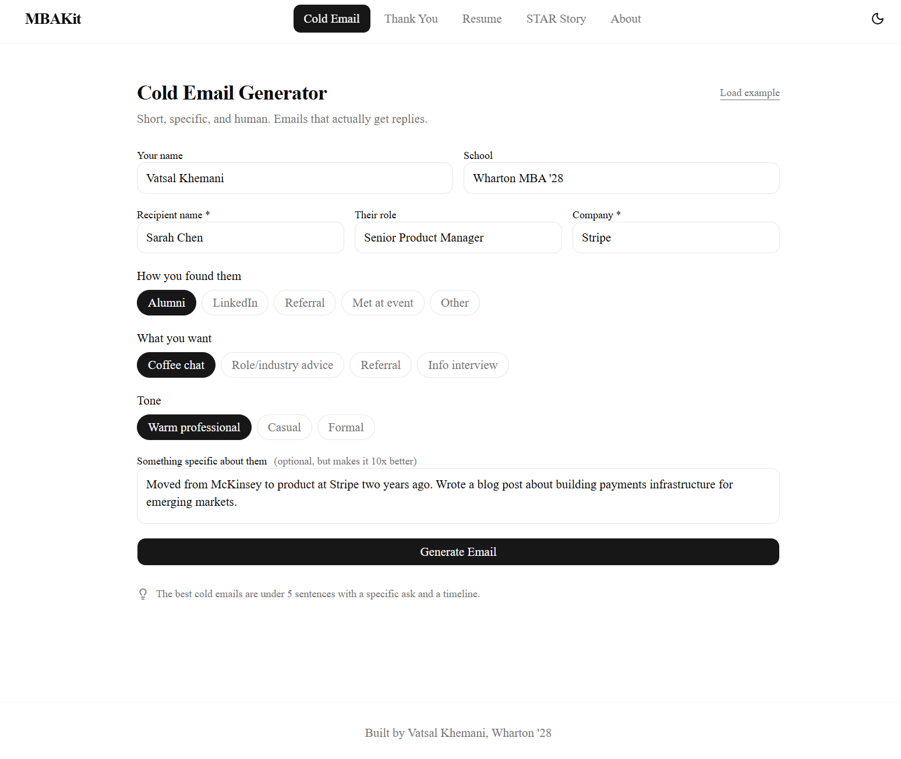

# MBAKit

**Free, sharp tools for the repetitive stuff in MBA life.**

MBA students spend hours every week on cold emails, thank-you notes, resume rewrites, and interview prep. MBAKit handles the repetitive parts so you can focus on what matters. Each tool encodes real expertise about what works in MBA recruiting, not generic AI output.

---

## The Tools

### Cold Email Generator
Write cold emails that actually get replies. Input your details and the recipient's context, get a 4-6 sentence email with a specific ask, credibility signal, and connection point. The tool explains *why* the email works so you learn the pattern.

### Thank You Note Writer
Send the right follow-up within 24 hours. References specific things from your conversation, suggests value-adds, and matches tone to context (coffee chat vs. final round vs. info session).

### Resume Bullet Sharpener
Paste 1-5 bullets, get a diagnosis of what's strong and what's weak, plus 3 improved versions per bullet ranked from safe to strongest. Flags passive voice, missing quantification, vague impact, and buried leads. Tailors to your target industry.

### STAR Story Builder
Describe a raw experience. Get back a structured Situation-Task-Action-Result story with strength checks, gap flags, competency tags, likely follow-up questions, and alternative framings. Built for behavioral interview prep.

---

## Screenshots

<div align="center">
  
  <p><em>Cold Email Generator</em></p>
</div>

---

## Getting Started

### Prerequisites

- Node.js 18+
- A Gemini API key ([get one free](https://aistudio.google.com/apikey))

### Setup

```bash
# Clone the repository
git clone https://github.com/vatsalkhemani/mbakit.git
cd mbakit

# Install dependencies
npm install

# Add your API key
cp .env.example .env.local
# Edit .env.local and add your GEMINI_API_KEY

# Start the dev server
npm run dev
```

Open [http://localhost:3000](http://localhost:3000) and you're ready to go.

---

## Technology Stack

| Layer | Choice |
|-------|--------|
| **Framework** | Next.js 16 (App Router), React 19, TypeScript |
| **Styling** | Tailwind CSS v4, shadcn/ui |
| **AI** | Google Gemini 3.1 Flash Lite (free tier) |
| **Hosting** | Vercel (free tier) |

For detailed technical documentation, see [ARCHITECTURE.md](./ARCHITECTURE.md).

---

## Contributing

Got an idea for a tool? Open an issue. Built something? Open a PR.

---

## Security

- API keys are stored server-side in `.env.local`, never exposed to the client
- `.env.local` is gitignored by default
- All AI calls are proxied through a Next.js API route

**Important:** Never commit your `.env.local` file.

---

## Author

**Vatsal Khemani**
Product Manager at Microsoft. Incoming Wharton MBA, Class of 2028.
