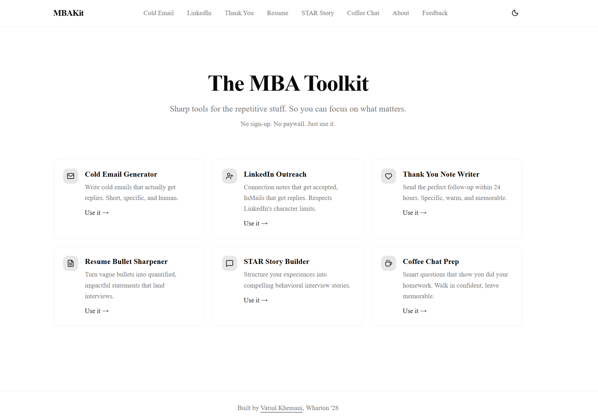
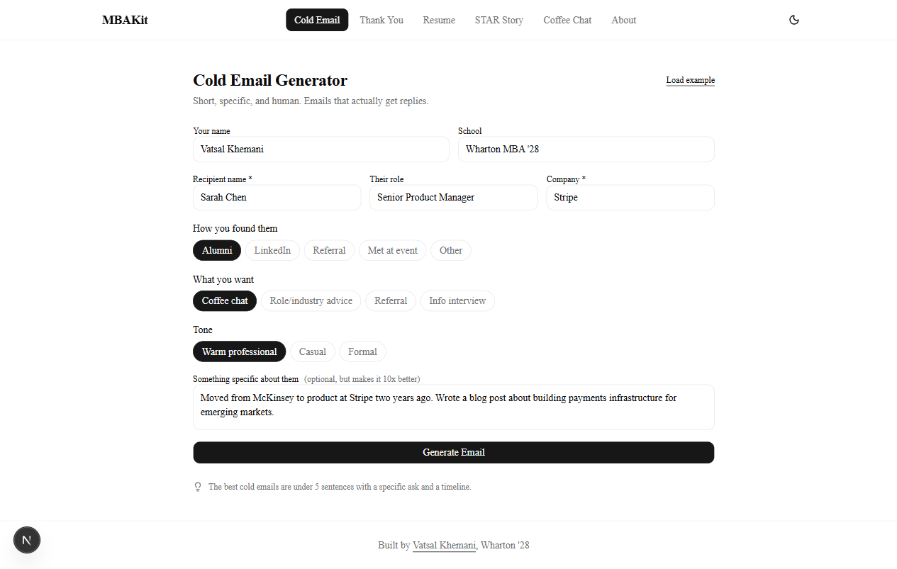

# MBAKit

**Free tools so you can focus on the conversations, not the drafting.**

The MBA is a stretch of constant networking, coffee chats, info sessions, and follow-ups. Every message, email, and piece of polish needs context, and most of us end up writing the same setup prompt to an LLM over and over just to get something usable out. That overhead adds up fast, and it pulls focus away from the actual interaction that matters.

MBAKit handles the drafting layer. Each tool already knows the context (recruiter vs. alum, coffee chat vs. final round, career switcher vs. insider), so you fill in a few specifics and get a sendable draft. Your energy stays on the conversation, the relationship, the follow-through. Not the prompt.

No sign-up. No paywall. No data stored. Just tools.

---

## The Tools

### Cold Email Generator
Short, specific, human cold emails that actually get replies. Takes your details plus recipient context and returns a 4 to 6 sentence email with a credibility signal, specific hook, and a concrete ask. Career-switcher aware.

### LinkedIn Outreach
Connection notes that get accepted and InMails that get replies. Respects LinkedIn's character limits (200 free, 300 premium for connection notes) and follows what actually works on the platform: greeting, one specific reason, no aggressive meeting ask in the connection note itself.

### Thank You Note Writer
Follow-up within 24 hours. Specific references to what you discussed, context-appropriate tone (coffee chat vs. final round vs. info session vs. intro follow-up), and a natural next step.

### Resume Bullet Sharpener
Paste 1 to 5 bullets, get a diagnosis of what's weak and 3 improved versions ranked safe to strongest. Flags passive voice, missing quantification, vague impact, buried leads. Translates non-traditional backgrounds into business language.

### STAR Story Builder
Raw experience in, structured Situation-Task-Action-Result story out. Includes strength checks, gap flags, competency tags, likely follow-ups, and alternative framings. Supports Tech PM, Consulting, Amazon LP, and general behavioral formats.

### Coffee Chat Prep
Tailored questions based on who you're meeting: role, company, seniority, and what you want to learn. Adapts for alumni vs. cold outreach and career-switcher context.

---

## Screenshots

<div align="center">
  
  <p><em>Home: all tools at a glance</em></p>
</div>

<div align="center">
  
  <p><em>Cold Email Generator in action</em></p>
</div>

---

## Features

- **Streaming output**: see your draft appear token-by-token as the AI writes
- **Copy + Download**: one click to copy or download any output as a text file
- **Generation history**: your last 10 generations per tool are saved locally, viewable and restorable anytime
- **Load example**: every tool has a pre-filled example so you can see what good input looks like
- **Dark mode**: automatic or manual theme toggle
- **Mobile-friendly**: works on phone, tablet, and desktop
- **No em-dashes**: every output uses clean punctuation, never the overused em-dash

All data stays in your browser. Nothing is sent to any server except the AI generation request itself.

---

## Getting Started

### Prerequisites

- Node.js 18+
- An NVIDIA NIM API key ([get one free](https://build.nvidia.com))

### Setup

```bash
git clone https://github.com/vatsalkhemani/mbakit.git
cd mbakit
npm install
cp .env.example .env.local
# Edit .env.local and add your NVIDIA_API_KEY
npm run dev
```

Open [http://localhost:3000](http://localhost:3000).

---

## Technology Stack

| Layer | Choice |
|-------|--------|
| **Framework** | Next.js 16 (App Router), React 19, TypeScript |
| **Styling** | Tailwind CSS v4, shadcn/ui |
| **AI** | NVIDIA NIM, Mistral Small 4 (free tier, streaming) |
| **Analytics** | Vercel Web Analytics (anonymous, no cookies) |
| **Hosting** | Vercel (free tier) |

No database. No auth. One serverless API endpoint.

---

## Quality

Every tool is evaluated with an automated quality harness before shipping. Each prompt is tested against realistic fixtures (both minimal-input and rich-input scenarios across different backgrounds, industries, and interview types). An LLM-as-judge scores each output on format compliance, hallucination control, sendability, voice, and tool-specific criteria. Every run is logged in [evals/RUNLOG.md](evals/RUNLOG.md).

The shipping bar is **every fixture scoring GREAT** (all dimensions ≥4, majority at 5) across three consecutive runs. See [evals/METHODOLOGY.md](evals/METHODOLOGY.md) for details.

---

## Security

- System prompts live server-side only: the client sends a tool ID, not raw prompts
- API keys are stored in `.env.local`, never exposed to the client
- Server-side IP rate limiting (60 req/hr) prevents abuse
- Client-side daily rate limiting (20/tool/day) prevents accidental quota burn
- Input size validated (5,000 char max)
- All AI calls are proxied through a single Next.js API route

---

## Feedback

Bugs, feature ideas, or a prompt that gave you weird output: [send them here](https://mbakit.vercel.app/feedback) or message me on [LinkedIn](https://www.linkedin.com/in/vatsal-khemani-39a483192).

---

## Author

**[Vatsal Khemani](https://www.linkedin.com/in/vatsal-khemani-39a483192)**, Wharton '28, ex-Microsoft Copilot.
